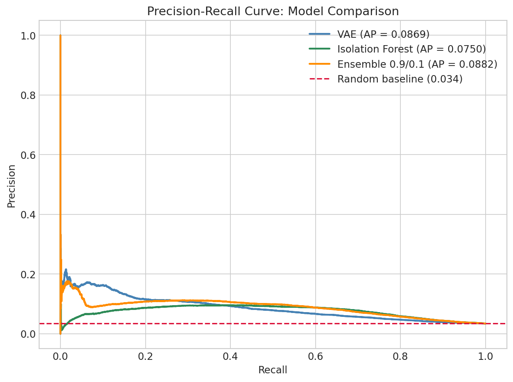

# Fraud Detection using Unsupervised Learning

Unsupervised anomaly detection on the IEEE-CIS Fraud Detection dataset using a Variational Autoencoder (VAE) and Isolation Forest ensemble. No fraud labels are used during training.

---

## Results

| Model | AUROC | Average Precision |
|-------|-------|-------------------|
| VAE | 0.6931 | 0.0869 |
| Isolation Forest | 0.7326 | 0.0750 |
| **Ensemble (0.9/0.1)** | **0.7269** | **0.0904** |
| Random baseline | 0.500 | 0.034 |

**AP of 0.0904 represents a 166% improvement over the random baseline** : achieved without access to a single fraud label during training.

---

## Dataset

[IEEE-CIS Fraud Detection](https://www.kaggle.com/c/ieee-fraud-detection) dataset provided by Vesta Corporation via Kaggle.

- 590,540 transactions
- 394 raw features across two tables (transaction and identity)
- 3.5% fraud rate, heavily imbalanced

---

## Approach

Standard supervised fraud detection requires labeled data, which is expensive to obtain and quickly becomes stale as fraud patterns evolve. This project takes a purely unsupervised approach: train models exclusively on normal transactions and flag anything that deviates from learned normal behavior as anomalous.

Two complementary models are combined in a weighted ensemble:

**Variational Autoencoder (VAE)** : learns a compressed latent representation of normal transactions. Fraudulent transactions, being unlike anything seen during training, produce higher reconstruction errors and are flagged as anomalies.

**Isolation Forest** : exploits the geometric sparsity of anomalies in feature space. Anomalous transactions are easier to isolate and therefore require fewer random partitions to separate from the rest of the data.

The two models detect fraud through fundamentally different mechanisms, making their combination more robust than either model alone.

---

## Key Design Decisions

**Data quality over model complexity** : early experiments on poorly cleaned data yielded AUROC as low as 0.54. Systematic feature selection through correlation filtering and sparsity checks was the single most impactful improvement, not model architecture.

**Two separate preprocessing pipelines** : V-columns (339 anonymized Vesta features) hurt the VAE by adding noise to the reconstruction objective, but help the Isolation Forest by providing additional dimensions for geometric anomaly isolation. Two preprocessors are fitted independently:
- `preprocessor_vae.pkl` : excludes V-columns
- `preprocessor_iso.pkl` : includes V-columns

**V-column selection** : V-columns are first filtered by pairwise correlation (threshold 0.75) to remove redundant features, then filtered by sparsity (dominant value > 90%) to remove near-constant columns. This reduces 339 V-columns to ~19 informative ones for the Isolation Forest.

**Time-ordered train/test split** : the dataset is split chronologically (80/20) rather than randomly. The model is trained on earlier transactions and evaluated on later ones, directly simulating real deployment conditions and preventing future data leakage.

**VAE checkpoint saving** : the best VAE checkpoint is saved at the epoch with the highest Average Precision (after a 5-epoch warmup), not the final epoch. The reconstruction loss and anomaly detection performance are decoupled : continued training eventually makes the model too good at reconstructing everything, including fraud. The best checkpoint at epoch 26 yields AP 0.0876; the final epoch yields AP ~0.080.

**Hyperparameter tuning** : both models are tuned via grid search:
- VAE: β ∈ {1.0, 2.0, 5.0}, z_dim ∈ {3, 5, 10}, lr ∈ {1e-3, 5e-4, 1e-4} → best: β=1, z_dim=3, lr=1e-4
- Isolation Forest: n_estimators ∈ {50, 100, 150, 200}, max_features ∈ {0.5, 0.75, 1.0} → best: n_estimators=50, max_features=0.5

---

## Project Structure

```
├── IEEE_notebook.ipynb
├── requirements.txt                            # All libraries required 
├── README.md
├── Report
│   ├── figures                                 # All figures 
│   └── results
│       ├── fraud_errors.npy
│       ├── grid_search.csv
│       ├── grid_search_Iso.csv
│       ├── iso_normalized.npy
│       ├── normal_errors.npy
│       ├── reconstruction_errors.npy
│       ├── test_labels.npy
│       ├── training_aps.npy
│       ├── training_aurocs.npy
│       ├── training_losses.npy
│       └── vae_normalized.npy
├── data                                        # Processed data (not tracked)
│   └── processed
│       ├── full_clean_dataset.csv
│       ├── testlabel.npy
│       ├── testset_Iso.npy
│       ├── testset_VAE.npy
│       ├── trainset_Iso.npy
│       └── trainset_VAE.npy
├── ieee-fraud-detection                        # Raw data (not tracked)
│   ├── train_identity.csv
│   └── train_transaction.csv
├── metadata
│   └── feature_name.json
└── model
    ├── best_vae.pt
    ├── iso_forest.pkl
    ├── transform_rule_Iso.pkl
    └── transform_rule_VAE.pkl
```

---

## How to Run

**1. Install dependencies**
```bash
pip install -r requirements.txt
```
> Note: `torch==2.10.0+cu128` requires a CUDA 12.8 compatible GPU. For CPU-only installation replace this line with `torch==2.10.0` in `requirements.txt`.

**2. Download the dataset**

Download from [Kaggle](https://www.kaggle.com/c/ieee-fraud-detection) and place `train_transaction.csv` and `train_identity.csv` in `ieee-fraud-detection/`.

**3. Create the required folders**

The following folders are not tracked in this repository and must be created before running the notebook:
```bash
mkdir -p data/processed 
```

**4. Run the notebook**

Run `IEEE_notebook.ipynb` top to bottom. The notebook is self-contained and covers 
data loading, cleaning, EDA, preprocessing, model training and evaluation in order.

---

## Results




---

## Limitations

- **Test set exposure during ensemble tuning** : the ensemble weights (0.9/0.1) were selected by sweeping a grid evaluated on the test set. Strictly speaking, a held-out validation set should be used in production to avoid mild overfitting to the test set.
- **Unsupervised ceiling** : the supervised upper bound on this dataset is ~0.92 AUROC with labeled data. The gap represents the information value of fraud labels. In a real deployment, even a small labeled dataset would motivate a semi-supervised approach.
- **Concept drift** : the VAE's reconstruction-based anomaly score is sensitive to shifts in transaction patterns over time. The model would require periodic retraining as fraud patterns evolve.

---

## Validation

As an additional sanity check, COPOD (Copula-Based Outlier Detection) was run on the same features with no hyperparameter tuning, achieving AUROC 0.7181 and AP 0.0720. Three fundamentally different algorithms independently finding fraud signal in the same range confirms the preprocessing pipeline is sound and results are not an artifact of data leakage.
